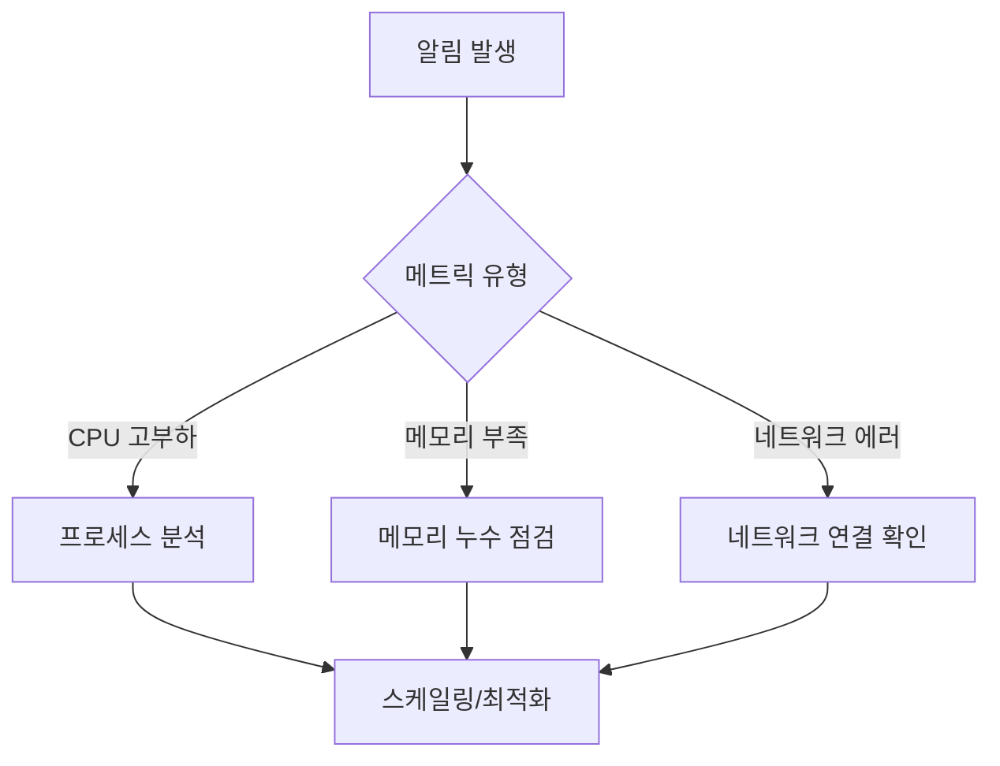

# 🎯 EKS 노드 모니터링 대시보드 (USE/RED Best Practice)

## 📋 개요

이 Grafana 대시보드는 **Amazon EKS 워커 노드의 종합적인 성능 모니터링**을 위해 설계되었습니다. **USE 방법론**(Utilization, Saturation, Errors)과 **RED 방법론**(Rate, Errors, Duration)을 통합 적용하여, 엔터프라이즈 환경에서 요구하는 실무적 모니터링 표준을 구현합니다.

### 🎁 주요 특징

- ✅ **USE + RED 하이브리드 방법론** 적용
- ✅ **코어 정규화된 지표** (CPU 코어 수 기반 Load Average)
- ✅ **시각화 최적화**: Gauge, TimeSeries, Table 적절한 조합
- ✅ **템플릿 변수**: `$node` 변수로 특정 노드 필터링 지원
- ✅ **색상 임계값**: 녹색(정상) → 노란색(주의) → 빨간색(위험)
- ✅ **30초 자동 새로고침**: 실시간 모니터링

## 🏗️ 대시보드 구성

### 📊 **1. 클러스터 개요 (Overview) - 신속한 상태 파악**

**목적**: 클러스터 전체 상태를 한눈에 파악
**시각화**: Stat 패널 + Gauge 패널 조합

| 패널                  | 메트릭                                               | 시각화          | 임계값                       | 필요성             |
| --------------------- | ---------------------------------------------------- | --------------- | ---------------------------- | ------------------ |
| 🔢 총 노드 수         | `count(up{job="node-exporter"})`                     | Stat            | -                            | 클러스터 규모 확인 |
| ✅ Ready 노드         | `sum(kube_node_status_condition{condition="Ready"})` | Stat            | 빨강(0) → 노랑(1) → 녹색(2+) | 가용 노드 수 확인  |
| 💻 평균 CPU 사용률    | `100 - (avg(irate(...)) * 100)`                      | **Gauge**       | 75%(노랑) → 90%(빨강)        | 전체 클러스터 부하 |
| 🧠 평균 메모리 사용률 | `100 * (1 - avg(...))`                               | **Gauge**       | 75%(노랑) → 90%(빨강)        | 메모리 압박 상태   |
| ⚠️ 노드 컨디션 상태   | `kube_node_status_condition`                         | **Color Table** | False(빨강) → True(녹색)     | 노드 건강 상태     |

### 🔥 **2. 자원 이용률 (USE - Utilization) - 높은 우선순위**

**목적**: 각 노드의 핵심 자원 사용률 추적
**시각화**: TimeSeries (시간 경과에 따른 변화)

| 패널                      | 메트릭                                                                      | 실무적 의미                  | 임계값    |
| ------------------------- | --------------------------------------------------------------------------- | ---------------------------- | --------- |
| 💻 CPU 사용률 (노드별)    | `100 - (irate(node_cpu_seconds_total{mode="idle"}[5m]) * 100)`              | 각 노드별 CPU 부하 분산 확인 | 75% → 90% |
| 🧠 메모리 사용률 (노드별) | `100 * (1 - (node_memory_MemAvailable_bytes / node_memory_MemTotal_bytes))` | 메모리 사용 패턴과 누수 탐지 | 75% → 90% |

### ⚡ **3. 포화도 (USE - Saturation) - 높은 우선순위**

**목적**: 시스템이 "포화" 상태에 도달하기 전 예측
**시각화**: TimeSeries (임계값 라인 표시)

| 패널                         | 메트릭                                             | 실무적 의미                               | 개선점                 |
| ---------------------------- | -------------------------------------------------- | ----------------------------------------- | ---------------------- |
| 📈 정규화된 시스템 로드 평균 | `node_load1 / count(node_cpu_seconds_total)`       | **CPU 코어 수로 정규화**: 1.0 = 100% 포화 | **Best Practice 적용** |
| 💿 디스크 I/O 포화도         | `irate(node_disk_io_time_seconds_total[5m]) * 100` | 디스크 병목 현상 탐지                     | 80% → 95%              |

### 🌐 **4. 네트워크 및 디스크 I/O (RED - Rate, Errors) - 실무 확장**

**목적**: RED 방법론 통합으로 서비스 수준 메트릭 제공
**시각화**: TimeSeries (다중 메트릭 비교)

| 패널                           | 메트릭                                   | RED 분류   | 실무적 가치              |
| ------------------------------ | ---------------------------------------- | ---------- | ------------------------ |
| 📡 네트워크 I/O (Rate)         | `irate(node_network_*_bytes_total[5m])`  | **Rate**   | 네트워크 처리량 모니터링 |
| 🚫 네트워크 에러/유실 (Errors) | `irate(node_network_*_errs_total[5m])`   | **Errors** | 네트워크 품질 문제 탐지  |
| 💾 디스크 IOPS (Rate)          | `irate(node_disk_*_completed_total[5m])` | **Rate**   | 스토리지 성능 분석       |

### 📋 **5. 추가 지표 (우선순위 낮음) - 보조 정보**

**목적**: 장기 추세 분석 및 용량 계획
**시각화**: TimeSeries (추세 분석)

| 패널                 | 메트릭                                                                   | 활용 목적                   |
| -------------------- | ------------------------------------------------------------------------ | --------------------------- |
| 💽 파일시스템 사용률 | `100 * (1 - (node_filesystem_avail_bytes / node_filesystem_size_bytes))` | 스토리지 용량 계획          |
| 🏠 포드 밀도         | `count(kube_pod_info) by (node)`                                         | 노드별 워크로드 분산 최적화 |

## 🛠️ 실무 활용 전략

### **1. 일상 운영 시나리오**

#### **정상 운영 시 (Green Zone)**

- **CPU < 75%, Memory < 75%, Load < 0.8**: 안정적 운영
- **모니터링 주기**: 주간 추세 분석
- **액션**: 용량 계획 업데이트

#### **주의 상황 (Yellow Zone)**

- **CPU 75-90%, Memory 75-90%, Load 0.8-1.2**: 성능 저하 가능성
- **모니터링 주기**: 시간당 확인
- **액션**: 스케일링 준비, 원인 분석

#### **위험 상황 (Red Zone)**

- **CPU > 90%, Memory > 90%, Load > 1.2**: 즉각적 대응 필요
- **모니터링 주기**: 실시간 감시
- **액션**: 긴급 스케일링, 장애 대응 절차

### **2. 문제 해결 워크플로**



### **3. SRE 베스트 프랙티스 적용**

#### **SLI (Service Level Indicators) 정의**

- **가용성**: Ready 노드 비율 > 95%
- **성능**: 평균 응답 시간 < 200ms (Load Average < 0.8)
- **용량**: CPU/메모리 사용률 < 80%

#### **알림 계층화**

```yaml
# 예시 Prometheus AlertManager 규칙
groups:
  - name: node-alerts
    rules:
      - alert: NodeHighCPU
        expr: (100 - (rate(node_cpu_seconds_total{mode="idle"}[5m]) * 100)) > 90
        for: 5m
        labels:
          severity: critical

      - alert: NodeHighMemory
        expr: (1 - (node_memory_MemAvailable_bytes / node_memory_MemTotal_bytes)) * 100 > 90
        for: 5m
        labels:
          severity: critical
```

## 🔧 커스터마이징 가이드

### **템플릿 변수 활용**

1. **특정 노드 그룹 모니터링**:

   ```promql
   # 예시: 워커 노드만 필터링
   node_cpu_seconds_total{instance=~".*worker.*"}
   ```

2. **환경별 분리**:
   - Production: `$node` = `prod-*`
   - Staging: `$node` = `stage-*`

### **임계값 조정**

**환경에 맞는 임계값 설정**:

- **개발 환경**: CPU 80% → 95% (여유 있게)
- **프로덕션**: CPU 70% → 85% (보수적으로)
- **배치 처리**: Memory 85% → 95% (높은 사용률 허용)

## 📊 메트릭 데이터 소스

### **Prometheus 쿼리 최적화**

- **Rate 함수**: `irate()` vs `rate()` - irate는 순간 변화량, rate는 평균
- **Group By**: 노드별 집계로 카디널리티 관리
- **Recording Rules**: 자주 사용하는 복잡한 쿼리는 사전 계산

### **데이터 보존 정책**

- **Raw 데이터**: 7일 (고해상도)
- **Downsampled**: 30일 (중해상도)
- **Aggregated**: 1년 (저해상도, 추세 분석용)

## 🚨 트러블슈팅

### **일반적인 문제들**

1. **메트릭이 표시되지 않는 경우**:

   ```bash
   # Node Exporter 상태 확인
   kubectl get pods -l app.kubernetes.io/name=node-exporter

   # ServiceMonitor 확인
   kubectl get servicemonitors -A
   ```

2. **높은 카디널리티 문제**:

   - 불필요한 라벨 제거
   - Recording Rules 활용
   - 메트릭 필터링 강화

3. **대시보드 로딩 지연**:
   - 시간 범위 단축 (1시간 → 15분)
   - 쿼리 최적화 (불필요한 그룹핑 제거)
   - 브라우저 캐시 초기화

## 📚 참고 자료

- [USE 방법론 - Brendan Gregg](http://www.brendangregg.com/usemethod.html)
- [RED 방법론 - Weaveworks](https://grafana.com/blog/2018/08/02/the-red-method-how-to-instrument-your-services/)
- [Prometheus Best Practices](https://prometheus.io/docs/practices/)
- [Grafana Dashboard Best Practices](https://grafana.com/docs/grafana/latest/dashboards/build-dashboards/best-practices/)

---

**📋 버전 정보**

- **Dashboard Version**: 2
- **UID**: `eks-nodes-monitoring`
- **Grafana 호환성**: v8.3.0+
- **Prometheus 요구사항**: Node Exporter, kube-state-metrics
- **업데이트**: 2025-08-27 (USE/RED 통합, 시각화 개선)

**🔄 업데이트 내역**

- v2.0: USE/RED 방법론 통합, 코어 정규화 로드 평균, 네트워크 에러 추가
- v1.0: 초기 USE 방법론 기반 대시보드
